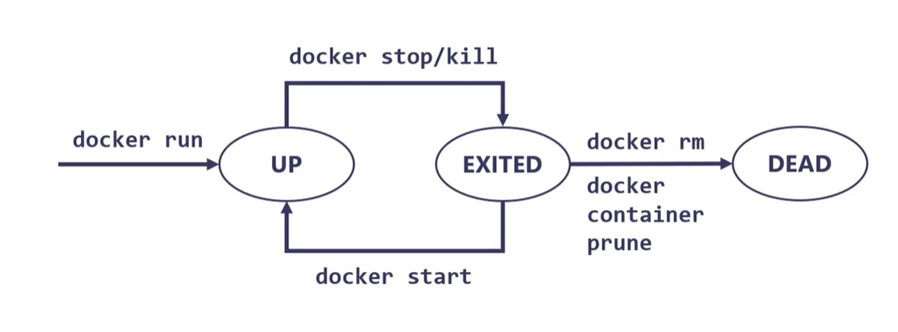

# Docker

## Table of Contents

1. [Docker là gì](#docker-là-gì)
2. [Khái niệm cơ bản](#khái-niệm-cơ-bản)
3. [Các câu lệnh cơ bản](#các-câu-lệnh-cơ-bản)
4. [Các khái niệm cốt lõi của container](#khái-niệm-cốt-lõi-của-container)
    1. [Chu kì sống](#chu-kì-sống-của-container )
    2. [Sâu hơn về chu kì sống của container](#sâu-hơn-về-chu-kì-sống-của-container)
    3. [Thực thi câu lệnh bên trong container](#thực-thi-câu-lệnh-bên-trong-container)
5. [Port mapping(nginx)](#port-mappingnginx)
6. [Volume - bind mount](#volume---bind-mount)
7. [Dockerfile](#dockerfile)
8. [Docker compose](#docker-compose)
    1. [docker-compose.yaml](#docker-composeyaml)
9. [Network](#network)

## Docker là gì
- Docker là công nghệ cho phép đóng gói các phụ thuộc lại thành 1 package và thực thi nó trên mọi môi trường
    - Image: là file cấu hình cần thiết để chạy ứng dụng
    - Container: là 1 không gian thực thi ứng dụng tách biệt bên ngoài được xây dựng từ Image
        - Container không phải là máy ảo vì nó không có Kernal(nhân), mà tất cả containers xài chung nhân của máy chủ vật lý
        - Kernal là lõi hệ thống nằm giữa phần cứng và phần mềm, điều khiển mọi thứ(mỗi hđh có 1 kernal riêng)
    - Container khác gì so với Virtual Machine(máy ảo)
        - Virtual machine sẽ phân chia phần cứng và cấp phát cho từng máy áo 1 tìa nguyên nhất định và nó không liên quan gì nhau, có thể sử dụng các hđh khác nhau
        - Container tân dụng lại phần nhân(kernal) của máy chủ vật lý để xử lý nên sẽ nhẹ hơn nhưng lại không tự do bằng Virtual Machine
            - Không thể chạy container ubuntu trên window được nên khi sử dụng window cần phải cài đặt máy ảo và Docker chạy bên trong
- Tại sao phải sử dụng docker
    - Tính nhất quán: docker đảm bảo chạy môi trường dev và prod đều giống nhau
    - Tách biệt: docker đảm bảo các container khác nhau chạy song song mà không xung đột tài nguyên với nhau
    - Tính di động: có thể chạy từ các hdh khác nhau, và nhân bản nó để sử dụng nhiều nơi khác nhau(microservices)
    - Nhẹ: docker nhẹ hơn Virtual Machine
    - Hỗ trợ devops
    - Kiểm soát tài nguyên: Có thể giới hạn tài nguyên cho docker, tối ưu hoá việc sử dụng tái nguyên

## Khái niệm cơ bản
- Docker engine:
    - Gồm 2 module chính
        - Docker Daemon: modul cốt lõi đóng vai tro là server chính của hệ thống
        - Docker client(cli): là client, gồm các bộ câu lệnh có thể giao tiếp với Docker Daemon bằng giao thức https
## Các câu lệnh cơ bản
- docker <docker_component> <docker_command>
    - docker components:
        - image
        - container
        - network
        - volume
        - ...
- Các câu lệnh phổ biến
    - ls: list
    - run
    - exec
    - stop
    - pull
    - prune
- Các câu lệnh trong component Image:
    - Pull image từ registry(nơi chứa image: docker hub)
        - docker image pull <docker_image>:<docker_tag>         #docker_tag chính là version của image, mặc định la latest
    - List ra các images
        - docker image ls
        - docker images
    - Xoá toàn bộ image không sử dụng nữa
        - docker image prune
- Các câu lệnh trong component Container:
    - Run:
        - docker container run <docker_image>
    - List:
        - docker container ls       # list tất cả các container đang chạy
        - docker container ls -a    # list ra tất cả các container bao gồm đã shutdowned
        - Shortcut:
            - docker ps
            - docker ps -a
    - Stop:
        - docker container stop <container_id>
    - Delete các container không sử dụng nữa:
        - docker container prune 
    - Câu lệnh để chạy 1 lệnh bên trong container
        - docker container exec <container_id> <command>
        - shortcut:
            - docker run
            - docker stop
            - docker exec

    
## Khái niệm cốt lõi của container

### Chu kì sống của container
- 
- Chu kì sống của container được quyết định bới tiến trình có PID=1
- Khi "docker stop" thì docker sẽ gửi tín hiệu để stop tiến trình PID 1 kia, sau đó container sẽ có Exited code = 0
- Trong vòng 10s sau khi sử dụng "docker stop" mà vì 1 lý do nào đó mà container chưa chịu dừng lại thì docker sẽ gửi tín hiệu và container sẽ dừng lập tức và có Exited code là 137

### Sâu hơn về chu kì sống của container
- Một số container cần có tương tác của người dùng (nó là PID=1)(postgres, redis, nodejs... vì nó là 1 server) thì nó sẽ tắt ngay sau khi chạy do không có bất kì người dùng nào cả
- Dẫn đến muốn duy trì nó thì phải có 2 cờ -it
    - -i or interactive: stdin(standard input) => luôn mở container
    - -t or -tty: pseudo-TTY #cấp phát 1 terminal ảo 
- Khi này container và command line sẽ attach với nhau: attach mode
- => Khi tắt terminal thì container cũng sẽ tắt luôn(Exited 130)
- Để tạm thời detach command line ra để làm việc gì đó 
    - Ctrl + P + Q    # detach mode
    - Để attach lại:
        + docker attach <container_id>
- Khi run docker mà trạng thái detach luôn
    - docker run -d <docker_image>

### Thực thi câu lệnh bên trong container
- docker exec <container_id> <command>
    - Ex: docker exec <container_id> echo Hello world
    - Ex: docker exec <container_id> sh -c "echo $PATH"         # in ra biến môi trường
- SSH(truy cập vào shell) vào trong container
    - docker exec -it <container_id> sh
    - docker exec -it <container_id> bash
    - Cái này khác hoàn toàn với việc attach và detach, nó sẽ  tạo 1 tiến trình phụ chứ không phải là PID=1

## Port mapping(nginx)
- Proxy là máy chủ trung gian giữa người dùng và internet
    - Forward proxy: đứng trước internet, khi người dùng gửi request sẽ thông qua proxy, và proxy sẽ gửi yêu cầu đến máy chủ đích nhằm ẩn danh
    - Reserve proxy: đứng sau internet, sẽ filter request và gửi đúng về từng máy chủ BE để xử lý 
        - Có thể sử dụng để cân bằng tải 
- nginx chính là 1 máy chủ Reverse proxy
- để có thể mapping 1 request của user vào localhost(server) với container nginx ta sử dụng port mapping để map port mặc định 80 của localhost và nginx
    - docker run -p <target_port>:<container_port> ...
        - docker run -p 80:80 -d nginx
    - In ra log bên trong của container:
        - docker logs -f <container_id>   => f: following, luôn giữ in log theo thời gian 

## Volume - bind mount
- Image thì bất biến
    - Sau khi build từ Dockerfile thì image là bất biến không thể thay đổi, chỉ có thể thay đổi Dockerfile để tạo ra 1 image khác
- Container thì stateless,
    - Dữ liệu trong container không được bảo toàn khi tắt là mất hết
    - Làm sao để giữ data lại, ví dụ như 1 container postgres
        - => Sử dụng volume

### Volume là gì
- Volume là phần bộ nhớ(ảo) mà docker dùng để lưu trữ dữ liệu(độc lập không bị mất khi tắt container hoặc volume)
- Bind mount:
    - Là phương pháp gắn kết một thư mục của host hoặc phần bộ nhớ ảo volume với của container để chia sẽ dữ liệu với nhau
- Syntax
    - docker volume create <volume_name>
    - docker run -v <local_folder_directory|volume>:<container_directory>       # có thể là volume(ảo) hoặc local_folder
        - Ex: 
            - docker volume create pgdata
            - docker run -v pgdata:/var/lib/postgresql/data -p 5432:5432 postgres
            - docker run /usr/data:/var/lib/postgresql/data -p 5432:5432 postgres
                - do data của postgres dựa trên linux => đổi directory của window vào sẽ bị lỗi định dạng
            - docker run -v "C:\users\html":/user/share/nginx/html -p 80:80 nginx
                - này thì được vì nó chỉ là 1 file html thôi, linux hay window đểu đọc được
    - Để biết được container directory thì có thể vào doc để đọc

## Dockerfile
- Nếu chúng ta thay đổi quá nhiều và phải binding mount ở quá nhiều nơi thì không thực tế
    - Build ra 1 image riêng cho chính mình
- Dockerfile là 1 template để hướng dẫn docker build ra 1 image theo từng bước 1
- Syntax:
    - docker build -t <image_name>:<tag> .          // dấu chấm đó chính là build context
### Build context
- Build context là tất cả nội dung bên trong của folder chứa dockerfile
- Docker client sẽ gửi toàn bộ nội dung cho Docker daemon để build ra docker image
    - Nếu như quá nhiều dữ liệu rác (images, videos...) không cần thiết thì sẽ tăng kích thước image
### .dockerignore
- Sẽ bỏ qua những folder được chỉ định trong build context

### Dockerfile keywords
- FROM <docker_image> # chỉ dịnh 1 image gốc ban đầu
- RUN <docker_command> # chạy câu lệnh
- WORKDIR <docker_directory> # thư mục mặc định của container khi khởi tạo
- COPY  <loca_src> <destination> # copy từ máy local sang image đó
- ADD   <local_src/URL> <destination> # tương tự copy nhưng có thể tải từ internet về, nếu file nén nó tự động giải nén
- EXPOSE <port> # thông báo cổng của container cho người dùng, chỉ là thông báo thôi
- CMD command <arg1> <arg2> # câu lệnh mồi chỉ thực thi khi container chạy, chạy thông qua shell
- CMD ["command","arg1","arg2"] # giống câu lệnh trên nhưng không thông qua shell, ngăn chặn tấn công shell injection

#### Docker push image
- docker login 
- docker push <docker_image>:<tag>

## Docker compose
- Giúp định nghĩa và triển khai loạt các container
- Cấu trúc file yaml
    - 

### docker-compose.yaml
```
version: <docker_engine_version> #lên trang chủ để xem
services: # đây chính là các containers
  pg:
    image: postgres:9.6-alpine
    ports:
      - 5432:5432
    volumes:
      - pgdata:/var/lib/postgresql/data   # pgdata là volume phải khai báo ở 1 phần khác cùng cấp với service
    environment:
      POSTGRES_DB: postgres         # những biến này sẽ được truyền vào container
      POSTGRES_USER: admin
      POSTGRES_DB: 1
  
   frontend:
     image: frontend           
     build:                                 # sẽ build image từ context 
       context: .

volumes:
  pgdata:                       # khai báo volume name

```
- Syntax:
    - Build service
        - docker-compose build <service_name>
            - Ex: docker-compose build frontend
    - Đọc docker-compose và khởi tạo tất cả services bên trong
        - docker-compose up -d
        - Nếu chỉ muốn khởi tạo 1 service
            - docker-commpose up -d <service_name>
    - In log màn hình
        - docker-compose logs -f <service_name>
    - Dừng service
        - docker-compose stop <service_name>
    - Shutdown toàn bộ container, dọn dẹp và giải phóng bộ nhớ


## Network
- Trong docker, network cho phép các container giao tiếp trực tiếp với nhau mà không phải thông qua bên ngoài, làm tăng hiệu suất và giảm độ trễ,
cho phép cách ly,bảo mật, và quản lý dễ dàng. Hỗ trợ trực tiếp cho microservices
- Thay vì BE sẽ connect thông qua 1 host(IP) sẽ phải đưa request ra internet và chuyển tiếp qua db server thì docker sẽ tạo network và chịu trách nhiệm giao tiếp cục bộ giữa chúng như 1 LAN dựa vào bộ phân giải tên miền của nó
```
version: '3.8'
services:
  backend:
    image: my_backend
    build:
      context: ./backend
    ports:
      - "3000:3000"
    environment:
      DB_HOST: db  # Tên service thay vì IP của host
      DB_NAME: mydatabase
      DB_USER: myuser
      DB_PASSWORD: mypassword
    networks:
      - my_network

  db:
    image: postgres:13
    environment:
      POSTGRES_DB: mydatabase
      POSTGRES_USER: myuser
      POSTGRES_PASSWORD: mypassword
    networks:
      - my_network

networks:
  my_network:
    driver: bridge
```